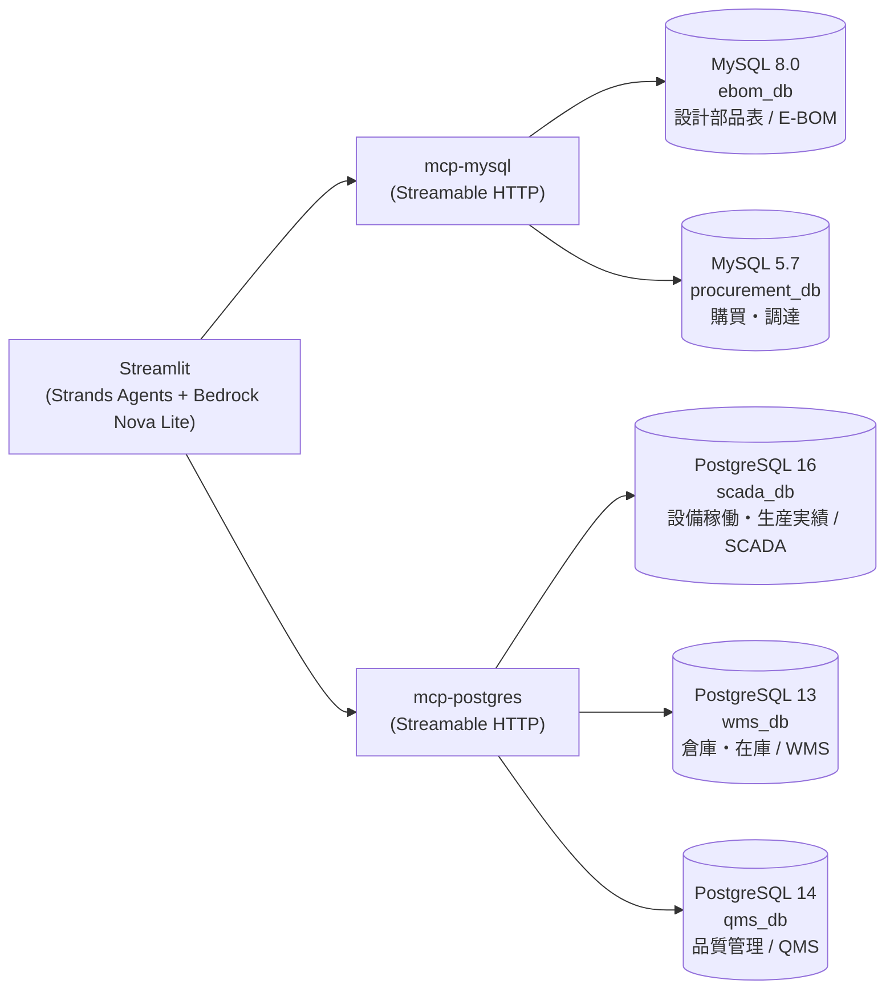
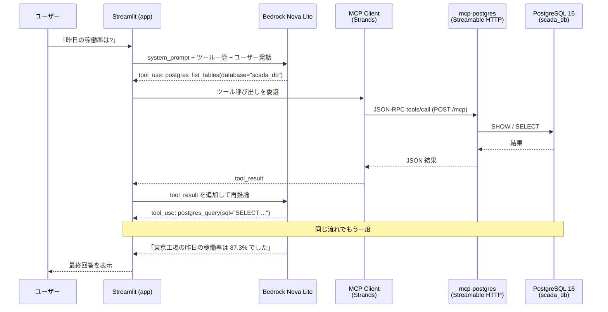

# RDS-MCP-Sample

工場で稼働する設備の情報(生産状況/不良数/生産実績/在庫/設計部品表/購買)を扱う社内システムを想定し、自然言語の問い合わせを LLM(Amazon Bedrock / Nova Lite)が解釈、**MCP 経由で複数の DB(エンジン違い・バージョン違いを含む)から横断的にデータを引いてくる**デモアプリ。

- すべて Docker で起動。ローカルにツールをインストール不要。
- 「複数 DB エンジン × 複数バージョン × 複数業務領域 × ロールベースのアクセス制御」を 1 台のホストで再現。

## 技術スタック

| レイヤー | 技術 | 用途 |
|---|---|---|
| LLM | Amazon Bedrock (Nova Lite) | 自然言語クエリの解釈・SQL 組み立て・結果の要約 |
| エージェント | [Strands Agents](https://strandsagents.com/) (Python) | LLM と MCP ツールを束ねるエージェントフレームワーク |
| UI | Streamlit | ロール切替・チャット UI |
| ツール連携 | MCP (Model Context Protocol) over Streamable HTTP | LLM ↔ DB の境界。自作の MCP サーバーを 2 種類同梱 |
| MCP SDK | [`mcp` (Python SDK)](https://github.com/modelcontextprotocol/python-sdk) の `FastMCP` | MCP サーバーの実装フレームワーク(ツール定義・Streamable HTTP トランスポート(ステートレス)) |
| MCP サーバー | Python + `mcp` SDK + Starlette / Uvicorn | Streamable HTTP トランスポートで MCP ツールを公開 |
| DB ドライバ | `mysql-connector-python` / `psycopg` (v3) | MCP サーバーから各 DB への接続 |
| データベース | MySQL 8.0 / 5.7、PostgreSQL 16 / 14 / 13 | 業務領域ごとにエンジン違い・バージョン違いを再現 |
| 実行基盤 | Docker Compose | 8 サービス(DB 5 + MCP 2 + App 1)を 1 ホストで起動 |
| 言語 | Python 3 | アプリ・MCP サーバーすべて |

### MCP サーバーの実装方針(公式・サードパーティ実装を使わない理由)

本リポジトリでは MySQL / PostgreSQL の MCP サーバーを **自作** している([mcps/mysql/server.py](mcps/mysql/server.py) / [mcps/postgres/server.py](mcps/postgres/server.py))。背景は以下:

#### 公式(リファレンス)実装の状況

- **MySQL**: [`modelcontextprotocol/servers`](https://github.com/modelcontextprotocol/servers) のリファレンス実装に MySQL は **そもそも存在しない**。
- **PostgreSQL**: かつてリファレンス実装が存在したが、現在は [`modelcontextprotocol/servers-archived`](https://github.com/modelcontextprotocol/servers-archived) に移されて **アーカイブ済み**(メンテナンス停止)。

#### サードパーティ実装も検討したが採用しなかった

代表的なサードパーティ実装として下記 2 つを調査したが、本デモの要件と噛み合わなかった:

| 候補 | 言語 | トランスポート | 1 プロセスから複数 DB | 採用しなかった主な理由 |
|---|---|---|---|---|
| [benborla/mcp-server-mysql](https://github.com/benborla/mcp-server-mysql) | Node.js 20+ | stdio(リモートは HTTP) | 同一ホスト内の複数 schema 想定 | **Streamable HTTP 非対応**。MySQL 8.0 と 5.7 の **別ホスト**(別コンテナ)を 1 プロセスから `alias` で切り替えるユースケースを直接サポートしていない。Python で統一したい本デモのスタックともずれる |
| [crystaldba/postgres-mcp](https://github.com/crystaldba/postgres-mcp) | Python 3.12+ | stdio / SSE | **不可(1 プロセス 1 接続)** | PostgreSQL 16 / 14 / 13 を 1 サーバーで切り替えるという本デモの中核要件に合わない(3 プロセス立てる構成になる)。また `pg_stat_statements` / `hypopg` 拡張のインストールが前提で、デモのセットアップを膨らませてしまう。さらに MCP 仕様で deprecated になった SSE のみの対応で、Streamable HTTP には未対応 |

> 念のため: これらは「本デモに合わない」というだけで、サードパーティ実装そのものが劣っているわけではない。特に `crystaldba/postgres-mcp` は **EXPLAIN・インデックス推薦・DB ヘルスチェック** など本デモには無いリッチな機能を備えており、単一 DB に対する LLM 連携をしっかり作りたい場面では有力な選択肢。

#### 結果として自作した理由

本デモは以下のデモ固有要件があり、自前実装の方が見通しが良い:

- **1 つの MCP サーバーから複数バージョン・複数 DB を `alias` で切り替える**(MySQL 8.0 + 5.7 を 1 つの `mcp-mysql` で、PostgreSQL 16/14/13 を 1 つの `mcp-postgres` で扱う)
- **Streamable HTTP トランスポート(ステートレス)**でコンテナ間通信する
- **`SELECT/WITH/SHOW/(DESCRIBE/)EXPLAIN` 以外を拒否する読み取り専用ガード**を入れる
- デモコードとして **読み手が全コードを 1 ファイルで追える**(各 MCP サーバーが約 150 行)

## アーキテクチャ



詳細な ER 図・論理設計・物理設計は [docs/database.md](docs/database.md) を参照。

## MCP の動作原理

### 一般論: MCP とは何か

**MCP (Model Context Protocol)** は、LLM(クライアント側)と外部ツール/データソース(サーバー側)の間を取り持つオープンな標準プロトコル。LSP(Language Server Protocol)が「エディタ ↔ 言語ツール」を抽象化したのと同じ発想で、「LLM ↔ ツール」を抽象化する。

**3 つの主役**:

| 役割 | 本デモでの実体 | 説明 |
|---|---|---|
| **MCP Host / Client** | Strands Agent(LLM 側) | LLM がツール呼び出しを必要としたときに、MCP サーバーへ JSON-RPC リクエストを送る |
| **MCP Server** | `mcp-mysql` / `mcp-postgres` | ツールの実体を持ち、リクエストを受けて実行・結果を返す |
| **Transport** | Streamable HTTP | Client と Server をつなぐ通信路。MCP 仕様(2025-03-26 以降)で推奨されるトランスポート。本デモは **ステートレスモード** で動かしており、各ツール呼び出しは独立した HTTP リクエスト/レスポンスで完結する |

**Server が公開する 3 種類のもの**(本デモでは Tools のみ使用):

- **Tools**: LLM が「呼び出せる関数」。引数と戻り値のスキーマを持つ。本デモの `mysql_query` / `postgres_list_tables` などがこれ。
- **Resources**: LLM が「読み取れるデータ」(ファイル風)。
- **Prompts**: 再利用可能なプロンプトテンプレート。

**プロトコルの中身**: JSON-RPC 2.0。`initialize` でハンドシェイク → `tools/list` でツール一覧取得 → `tools/call` で実行、という流れ。

**なぜ MCP が嬉しいか**:

- ツール定義(関数シグネチャ・説明文)が **LLM 自身に動的に渡せる**。LLM はプロンプトに書かれたツール定義を見て、必要なものを必要なタイミングで呼ぶ。
- LLM プロバイダ(OpenAI / Anthropic / Bedrock / ...)とツール実装を **疎結合** にできる。本デモも Strands Agent 経由で Bedrock Nova Lite を使っているが、別の LLM に差し替えても MCP サーバーには手を入れなくていい。
- ツール側を **別プロセス / 別コンテナ / 別ホスト** に置ける。権限の分離やスケーリングがやりやすい。

### 本リポジトリでの動き

#### 起動時(初期化フェーズ)

1. `app` コンテナの [app/agent.py](app/agent.py) が起動時に `MCPClient(lambda: streamable_http_client(mysql_url))` で `mcp-mysql` の Streamable HTTP エンドポイント (`http://mcp-mysql:8000/mcp`) に接続。`mcp-postgres` にも同様に接続。
2. `list_tools_sync()` で各サーバーから **ツール定義一覧** を取得。たとえば `mcp-mysql` からは:
   - `mysql_list_databases() -> [{alias, engine, version}]`
   - `mysql_list_tables(database: str) -> [str]`
   - `mysql_describe_table(database: str, table: str) -> [{...}]`
   - `mysql_query(database: str, sql: str, limit: int = 200) -> {columns, rows, row_count}`
   が返ってくる。これらは [mcps/mysql/server.py](mcps/mysql/server.py) で `@mcp.tool(...)` デコレータを付けた関数のシグネチャと docstring から `FastMCP` が自動で組み立てている。
3. Strands Agent は、この **ツール一覧** と [app/system_prompt.py](app/system_prompt.py) のロール別システムプロンプトを束ねて、Bedrock Nova Lite に渡せる「ツール付きエージェント」を組み立てる。

> 注: ツール名に `mysql_` / `postgres_` という **プレフィックス** が付いているのは、2 つの MCP サーバーから取得したツールを 1 つのエージェントに合流させたときに名前衝突を起こさないため。

#### 推論時(1 回のチャットで起きること)

ユーザーが「東京工場の昨日の稼働率を教えて」と入力したときの流れ:



ポイント:

- LLM は **一度に全部の SQL を書くわけではない**。まず `list_databases` でどんな DB があるか確認 → `list_tables` でテーブル名を見て → `describe_table` でカラムを把握 → 最後に `query` を発行、という **段階的な探索** をすることが多い。
- 各ステップで MCP Client は **新しい JSON-RPC リクエスト** を MCP Server に投げ、結果を LLM のコンテキストに追記して再推論する(ReAct ループ)。

#### Streamable HTTP トランスポートの実態(ステートレスモード)

Streamable HTTP は MCP 仕様(2025-03-26 以降)で標準・推奨に格上げされたトランスポート。SSE トランスポート(2 エンドポイント方式)を統合し、**単一の HTTP エンドポイント** で JSON-RPC をやりとりする。本デモでは:

- `mcp-mysql` コンテナで `FastMCP(..., stateless_http=True, json_response=True).run(transport="streamable-http")` が Starlette / Uvicorn 上に **1 本の HTTP エンドポイント** を立てる:
  - `POST /mcp` … Client が JSON-RPC リクエストを送るチャネル。レスポンスはステートレスモードでは `application/json` の単発レスポンスで返る(ストリーム不要)。
  - `GET /mcp` は本来サーバー側からの能動通知やセッション再開に使われるが、本デモのステートレスモードでは使わない。
- ステートレス化のオプションは 2 つ:
  - `stateless_http=True` … `Mcp-Session-Id` を発行せず、各リクエストを完全に独立扱いする。
  - `json_response=True` … 応答を `text/event-stream` ではなく純粋な JSON 1 本で返す。
- これにより以下の利点が得られる(本デモのワークロード = 短時間 SELECT を都度実行、と完全に整合):
  - **ALB / API Gateway / CloudFront 親和性**: SSE の長時間アイドル接続による LB タイムアウト問題が発生しない。
  - **水平スケール容易性**: セッション粘着性が不要なため、MCP サーバーをタスク複数台で前段 LB ラウンドロビンできる。
  - **再接続堅牢性**: 1 リクエスト = 1 接続で完結するため、Streamlit 再実行や瞬断で `MCPClient` のコンテキストが壊れない。

#### Server 側で何が起きているか([mcps/mysql/server.py](mcps/mysql/server.py))

`mysql_query(database, sql, limit)` が呼ばれたときの流れ:

1. `_SELECT_RE` で **SQL の先頭が SELECT/WITH/SHOW/DESCRIBE/EXPLAIN のいずれか** を検査。違えば例外。
2. `_FORBIDDEN_RE` で **書き込み系キーワード**(INSERT/UPDATE/DELETE/DROP/...)を含むかを検査。違えば例外。
3. セミコロン分割の **複文** を拒否。
4. SELECT で LIMIT が無ければ自動で `LIMIT 200` を付与。
5. `MYSQL_TARGETS` の `alias` をキーに接続情報を引いて `mysql.connector.connect()`。複数バージョンの MySQL に同一プロセスから接続できるのはこの仕組みのおかげ。
6. 結果セットを `{columns, rows, row_count}` に整形。`datetime` は `isoformat()`、`Decimal` は `float`、`bytes` は UTF-8 に正規化して JSON シリアライズ可能にする。
7. `FastMCP` がこの返り値を JSON-RPC レスポンスに包んで `POST /mcp` の単発 JSON 応答として Client に返す。

PostgreSQL 側 ([mcps/postgres/server.py](mcps/postgres/server.py)) もほぼ同じ構造。違いは `psycopg.connect(conninfo, autocommit=True)` を使い、テーブル一覧は `information_schema.tables` から、カラム情報は `information_schema.columns` から取っている点。

#### ロール制御はどこで効くか

MCP サーバー自体は **「来たクエリを実行するだけ」** で、ロールという概念を持たない。アクセス制御は以下の 2 段で実装している:

1. **アプリ層(本デモのソフトな統制)**: [app/system_prompt.py](app/system_prompt.py) がロールに応じて「使ってよい DB alias」「絞り込むべき拠点 ID」をシステムプロンプトに固定埋め込み。LLM はこれに従って `database=...` を選び、`WHERE site_id=...` を組み立てる。
2. **(本番想定)DB 層**: MCP サーバーの接続ユーザーに DB ロール / VIEW での GRANT を付与して、SQL レベルで読めるものを物理的に制限する。本デモでは省略している。

つまり本デモは **「LLM がプロンプトに従うこと」と「MCP サーバーの読み取り専用ガード」の二重防御** で成り立っている。

## セットアップ

### 必要なもの
- Docker Desktop(Windows / macOS / Linux)
- Amazon Bedrock の API キー(Nova Lite が利用可能なリージョン)

### 起動手順

```bash
# 1. env ファイルを準備
cp .env.example .env.local
# .env.local の BEDROCK_API_KEY などを書き換える

# 2. ビルドして起動(--env-file で .env.local の変数を compose に補間させる)
docker compose --env-file .env.local up -d --build

# 3. 起動確認(8 サービスが healthy / running になればOK)
docker compose --env-file .env.local ps

# 4. ブラウザで http://localhost:8501 を開く
```

初回起動時は SCADA の seed(約 17,000 行)の流し込みで 1〜2 分かかります。`docker compose logs -f postgres16` で進捗が見えます。

### 停止 / クリーンアップ

```bash
# 停止だけ(データは残る)
docker compose --env-file .env.local down

# 完全削除(DB ボリュームも消す)
docker compose --env-file .env.local down -v
```

## デモシナリオ

サイドバーでロールを切り替えて質問してください。ロールごとに見える DB と拠点が変わります。

| ロール | 拠点 | アクセス可能 DB | 想定質問 |
|---|---|---|---|
| Tokyo - 設計者 | 東京工場 | 設計部品表 (E-BOM) / 設備稼働 (SCADA) / 品質管理 (QMS) | 「ベアリング系の部品の設計変更履歴を見せて」 |
| Tokyo - 購買担当 | 東京工場 | 購買・調達 / 設計部品表 (E-BOM) / 倉庫・在庫 (WMS) | 「東京製鋼株式会社の発注で納期遅れリスクがあるものは?」 |
| Tokyo - 現場オペレーター | 東京工場 | 設備稼働 (SCADA) / 倉庫・在庫 (WMS) | 「東京工場の第2ラインの昨日の稼働率は?」 |
| Osaka - 設計者 / 購買 / オペレーター | 大阪工場 | (同上) | (同上、大阪工場に対して) |
| 品質マネージャー | 全社 | 品質管理 (QMS) / 設備稼働 (SCADA) / 設計部品表 (E-BOM) | 「不良率が悪化したラインと、原因部品の設計変更履歴」 |
| 管理者 | 全社 | 全 DB | 「全社の稼働率トップ 3 ラインと、サプライヤーの納期遵守率」 |

**境界テスト例**: ロールを `tokyo_operator` にして「Osaka の在庫を教えて」と聞くと、拠点スコープ違反として拒否されます。

## おすすめプロンプト

複数 DB(エンジン違い・バージョン違い)を横断するデモ映えする質問例。サイドバーでロールを切り替えてから貼り付けてください。

### admin(全 DB 横断 / デモのハイライト)

```text
ここ1週間で稼働率が最も低かったライントップ3を SCADA から抽出して、
そのライン主力部品の在庫(WMS)と直近の発注ステータス(購買)、
さらに不良発生状況(QMS)を一覧にまとめてください。
```
→ SCADA(Postgres 16) → WMS(Postgres 13) → 購買(MySQL 5.7) → QMS(Postgres 14) の 4 DB 横断、エンジン跨ぎ。

```text
全社の生産実績を日別に集計し、不良率ワースト10日を特定してください。
その日に検査(QMS)で NG が多かった部品トップ3を出し、
それらの部品の設計変更履歴(E-BOM)と、関連サプライヤーの納期遵守率(購買)も併せて示してください。
```
→ SCADA → QMS → E-BOM → 購買、5 DB 全部を使う連鎖クエリ。

```text
直近30日のサプライヤー別納期遵守率を購買から計算し、
ワースト3サプライヤーが供給している部品(E-BOM)と
それらの現在の在庫水準(WMS)、関連する不良件数(QMS)を出してください。
```
→ 購買 → E-BOM → WMS → QMS、ボトルネック分析。

### quality_manager(品質目線 / 3 DB 横断)

```text
直近1週間で不良率が悪化したラインを QMS で特定し、
その時間帯のセンサー異常(温度・振動)を SCADA で確認、
原因と思われる部品の設計変更履歴を E-BOM で照合してください。
```

```text
重大度が high の不良(QMS)が多い部品トップ5と、それぞれの設計変更件数(E-BOM)を一覧にして、
変更の多い部品から優先的に対策を打つべき順番を提案してください。
```

### tokyo_buyer / osaka_buyer(購買目線 / 3 DB 横断)

```text
発注ステータスが ordered のまま 14 日以上経過している PO を購買から抽出し、
対象部品の現在在庫(WMS)と、その部品を使う製品(E-BOM)を表示してください。
欠品リスクが高い順に並べてください。
```

```text
直近30日の在庫消費ペース(WMS の stock_movements)から、
今後10日で欠品しそうな部品トップ10を予測し、
各部品のサプライヤーとリードタイム(購買)、現在のオープン PO(購買)を一覧にしてください。
```

### tokyo_operator / osaka_operator(現場目線 / 2 DB 横断)

```text
昨日の第2ラインの時間帯別稼働率(SCADA)を出し、
停止していた時間帯に何か部品の急な出庫(WMS の stock_movements)があったか確認してください。
```

```text
直近24時間で温度が40度を超えた設備(SCADA)があれば、
その設備が属するラインで稼働中だった時間と生産量も併せて教えてください。
```

### アクセス制御の境界テスト

ロール選択を **`tokyo_operator`** にして以下を投げると、拠点スコープ違反として LLM が拒否します(クエリは発行されない)。

```text
大阪工場の第1ラインの昨日の稼働率を教えて
```

ロール選択を **`tokyo_buyer`** にして以下を投げると、アクセス可能 DB に SCADA が含まれないため拒否されます。

```text
SCADA の設備温度ログを見せて
```

### デモのおすすめ順番

1. **admin の 1 問目**(稼働率ワースト → 在庫・発注・不良)で「複数 DB 横断」のインパクトを見せる
2. **quality_manager の 1 問目**で「業務文脈に沿った連鎖クエリ」を見せる
3. **`tokyo_operator` で Osaka を聞く** 境界テストで「ロール制御が効いている」ことを見せる
4. 最後に **admin で「全 DB の一覧を出して」** と聞かせて、ツール出力で実際に MySQL 5.7 / 8.0 と PostgreSQL 13 / 14 / 16 が裏で動いていることを示す

## ロールベース・アクセス制御の仕組み

[app/auth.py](app/auth.py) で「ロール → 拠点 ID + アクセス可能 DB」を定義し、[app/system_prompt.py](app/system_prompt.py) でその情報をシステムプロンプトに固定埋め込みします。LLM はそのプロンプトに従って WHERE 句を組み立てるため、**アプリ層のフィルタとして機能**します。

> **注意**: これは LLM がプロンプトに従う前提のソフトな統制です。本番運用では DB ロール/VIEW での GRANT を併用することを推奨します。

## トラブルシュート

- **MySQL の seed が流れない**: `docker compose down -v` でボリュームごと削除して再度 up。`docker-entrypoint-initdb.d` は初回起動時しか走らないため。
- **Bedrock 認証エラー**: Strands Agents(Python)は `BEDROCK_API_KEY` を直接見ないので、[app/main.py](app/main.py) で `AWS_BEARER_TOKEN_BEDROCK` にコピーしています。boto3 のバージョンによっては Bearer 認証を受け付けないことがあります。その場合は `.env.local` に `AWS_ACCESS_KEY_ID` / `AWS_SECRET_ACCESS_KEY` を入れてください。
- **MySQL 5.7**: サポート終了済みのバージョンですが、「複数バージョン違いを再現するデモ用途」として採用しています。本番では使わないでください。

## ファイル構成

```
RDS-MCP-Sample/
├─ docker-compose.yml                 # 8 サービスの定義
├─ .env.example
├─ docs/
│  └─ database.md                     # ER 図 + 論理設計 + 物理設計(DDL)
├─ app/                               # Streamlit + Strands Agents
│  ├─ main.py / agent.py / auth.py / system_prompt.py
│  └─ Dockerfile / requirements.txt
├─ mcps/                              # MCP レイヤー(将来 MCP サーバーを追加するときもここに置く)
│  ├─ mysql/                          # MySQL 向け自作 MCP サーバー(Streamable HTTP)
│  │  └─ server.py / Dockerfile / requirements.txt
│  └─ postgres/                       # PostgreSQL 向け自作 MCP サーバー(Streamable HTTP)
│     └─ server.py / Dockerfile / requirements.txt
├─ db-init/
│  ├─ ebom/         (MySQL 8.0)
│  ├─ procurement/  (MySQL 5.7)
│  ├─ scada/        (Postgres 16)
│  ├─ wms/          (Postgres 13)
│  └─ qms/          (Postgres 14)
└─ scripts/
   └─ generate_seed.py                # seed SQL の再生成スクリプト
```
