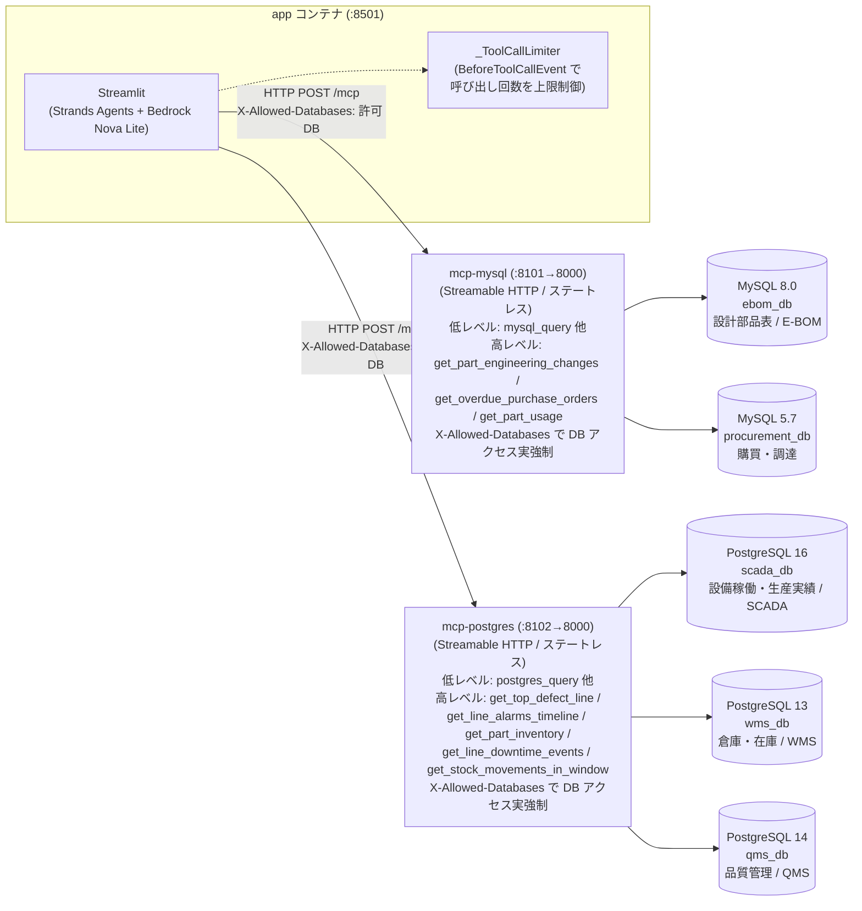
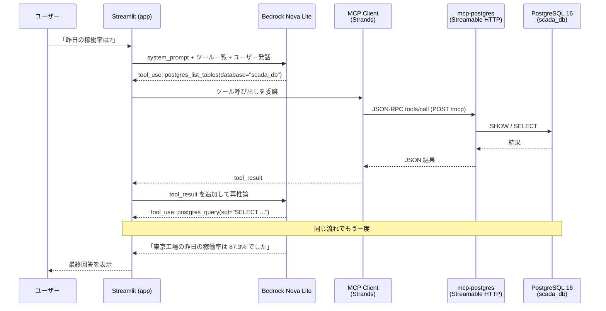

# RDS-MCP-Sample

工場で稼働する設備の情報(生産状況/不良数/生産実績/在庫/設計部品表/購買)を扱う社内システムを想定し、自然言語の問い合わせを LLM(Amazon Bedrock / Nova Lite)が解釈、**MCP 経由で複数の DB(エンジン違い・バージョン違いを含む)から横断的にデータを引いてくる**デモアプリ。

- すべて Docker で起動。ローカルにツールをインストール不要。
- 「複数 DB エンジン × 複数バージョン × 複数業務領域 × ロールベースのアクセス制御」を 1 台のホストで再現。

## 技術スタック

| レイヤー | 技術 | 用途 |
|---|---|---|
| LLM | Amazon Bedrock (Nova Lite) | 自然言語クエリの解釈・SQL 組み立て・結果の要約 |
| エージェント | [Strands Agents](https://strandsagents.com/) (Python) | LLM と MCP ツールを束ねるエージェントフレームワーク |
| UI | Streamlit | ロール切替・チャット UI |
| ツール連携 | MCP (Model Context Protocol) over Streamable HTTP | LLM ↔ DB の境界。自作の MCP サーバーを 2 種類同梱 |
| MCP SDK | [`mcp` (Python SDK)](https://github.com/modelcontextprotocol/python-sdk) の `FastMCP` | MCP サーバーの実装フレームワーク(ツール定義・Streamable HTTP トランスポート(ステートレス)) |
| MCP サーバー | Python + `mcp` SDK + Starlette / Uvicorn | Streamable HTTP トランスポートで MCP ツールを公開 |
| DB ドライバ | `mysql-connector-python` / `psycopg` (v3) | MCP サーバーから各 DB への接続 |
| データベース | MySQL 8.0 / 5.7、PostgreSQL 16 / 14 / 13 | 業務領域ごとにエンジン違い・バージョン違いを再現 |
| 実行基盤 | Docker Compose | 8 サービス(DB 5 + MCP 2 + App 1)を 1 ホストで起動 |
| 言語 | Python 3 | アプリ・MCP サーバーすべて |

### MCP サーバーの実装方針(公式・サードパーティ実装を使わない理由)

本リポジトリでは MySQL / PostgreSQL の MCP サーバーを **自作** している([mcps/mysql/server.py](mcps/mysql/server.py) / [mcps/postgres/server.py](mcps/postgres/server.py))。背景は以下:

#### 公式(リファレンス)実装の状況

- **MySQL**: [`modelcontextprotocol/servers`](https://github.com/modelcontextprotocol/servers) のリファレンス実装に MySQL は **そもそも存在しない**。
- **PostgreSQL**: かつてリファレンス実装が存在したが、現在は [`modelcontextprotocol/servers-archived`](https://github.com/modelcontextprotocol/servers-archived) に移されて **アーカイブ済み**(メンテナンス停止)。

#### サードパーティ実装も検討したが採用しなかった

代表的なサードパーティ実装として下記 2 つを調査したが、本デモの要件と噛み合わなかった:

| 候補 | 言語 | トランスポート | 1 プロセスから複数 DB | 採用しなかった主な理由 |
|---|---|---|---|---|
| [benborla/mcp-server-mysql](https://github.com/benborla/mcp-server-mysql) | Node.js 20+ | stdio(リモートは HTTP) | 同一ホスト内の複数 schema 想定 | **Streamable HTTP 非対応**。MySQL 8.0 と 5.7 の **別ホスト**(別コンテナ)を 1 プロセスから `alias` で切り替えるユースケースを直接サポートしていない。Python で統一したい本デモのスタックともずれる |
| [crystaldba/postgres-mcp](https://github.com/crystaldba/postgres-mcp) | Python 3.12+ | stdio / SSE | **不可(1 プロセス 1 接続)** | PostgreSQL 16 / 14 / 13 を 1 サーバーで切り替えるという本デモの中核要件に合わない(3 プロセス立てる構成になる)。また `pg_stat_statements` / `hypopg` 拡張のインストールが前提で、デモのセットアップを膨らませてしまう。さらに MCP 仕様で deprecated になった SSE のみの対応で、Streamable HTTP には未対応 |

> 念のため: これらは「本デモに合わない」というだけで、サードパーティ実装そのものが劣っているわけではない。特に `crystaldba/postgres-mcp` は **EXPLAIN・インデックス推薦・DB ヘルスチェック** など本デモには無いリッチな機能を備えており、単一 DB に対する LLM 連携をしっかり作りたい場面では有力な選択肢。

#### 結果として自作した理由

本デモは以下のデモ固有要件があり、自前実装の方が見通しが良い:

- **1 つの MCP サーバーから複数バージョン・複数 DB を `alias` で切り替える**(MySQL 8.0 + 5.7 を 1 つの `mcp-mysql` で、PostgreSQL 16/14/13 を 1 つの `mcp-postgres` で扱う)
- **Streamable HTTP トランスポート(ステートレス)**でコンテナ間通信する
- **`SELECT/WITH/SHOW/(DESCRIBE/)EXPLAIN` 以外を拒否する読み取り専用ガード**を入れる(`DESCRIBE` は MySQL 側のみ許可。PostgreSQL には `DESCRIBE` 文が無いため対象外)
- デモコードとして **読み手が全コードを 1 ファイルで追える**(各 MCP サーバーが 1 ファイル完結。低レベルツール + 高レベル業務ツール + `X-Allowed-Databases` による DB アクセス実強制を同梱した結果、`mcps/mysql/server.py` が約 355 行、`mcps/postgres/server.py` が約 505 行)

## アーキテクチャ



- **`app` コンテナ**は Streamlit + Strands Agents。ロールの許可 DB を `X-Allowed-Databases` ヘッダに載せて MCP サーバーへ送り、`_ToolCallLimiter` フックでツール呼び出し回数を `AGENT_MAX_TOOL_CALLS`(既定 40)に制限する。
- **各 MCP サーバー**は低レベルツール(`*_query` など)に加え、ユースケース特化の**高レベル業務ツール**を公開する。受け取った `X-Allowed-Databases` をもとに**ツールが触る DB を実行前に検証し、許可外なら拒否する**(プロンプトのソフト統制とは別の実防御)。
- ポートはホスト側 `8101`(mcp-mysql)/ `8102`(mcp-postgres)/ `8501`(app)に公開。コンテナ間はサービス名で名前解決する。

詳細な ER 図・論理設計・物理設計は [docs/database.md](docs/database.md) を参照。

## 業務システム用語解説

本デモで登場する工場系システムの略称を簡単に解説します。

| 略称 | 正式名称 | 概要 |
|---|---|---|
| **SCADA** | Supervisory Control and Data Acquisition(監視制御・データ収集) | 工場の設備・センサーから温度・振動・稼働状態などをリアルタイムに収集・監視するシステム。本デモでは生産ライン別の稼働状況・アラート・生産実績データを格納。 |
| **WMS** | Warehouse Management System(倉庫管理システム) | 倉庫内の入出庫・在庫位置・在庫数量をリアルタイムに管理するシステム。本デモでは部品・製品の在庫量や出庫履歴を格納。 |
| **QMS** | Quality Management System(品質管理システム) | 製造工程で発生した不良品・検査結果・品質指標を記録・分析するシステム。本デモではライン別の不良件数・不良率・検査記録を格納。 |
| **E-BOM** | Engineering Bill of Materials(設計部品表) | 製品を構成する部品の階層構造(親品番 → 子品番 → 孫品番)を定義した設計文書。本デモでは部品構成・設計変更履歴を格納。BOM 単体では「部品表」、E-BOM は設計段階の部品表を指す(製造段階は M-BOM と呼ばれることが多い)。 |
| **調達 / Procurement** | — | 購買・発注管理。サプライヤーへの発注(PO: Purchase Order)、納品日、納期遵守状況などを管理するシステム。本デモでは発注データと納期実績を格納。 |

> これらは独立したシステムとして運用されることが多く、部署をまたいだデータ連携が困難でした。本デモはその横断的なデータ参照を MCP 経由で自然言語から実現する点がポイントです。

## MCP の動作原理

### 一般論: MCP とは何か

**MCP (Model Context Protocol)** は、LLM(クライアント側)と外部ツール/データソース(サーバー側)の間を取り持つオープンな標準プロトコル。LSP(Language Server Protocol)が「エディタ ↔ 言語ツール」を抽象化したのと同じ発想で、「LLM ↔ ツール」を抽象化する。

**3 つの主役**:

| 役割 | 本デモでの実体 | 説明 |
|---|---|---|
| **MCP Host / Client** | Strands Agent(LLM 側) | LLM がツール呼び出しを必要としたときに、MCP サーバーへ JSON-RPC リクエストを送る |
| **MCP Server** | `mcp-mysql` / `mcp-postgres` | ツールの実体を持ち、リクエストを受けて実行・結果を返す |
| **Transport** | Streamable HTTP | Client と Server をつなぐ通信路。MCP 仕様(2025-03-26 以降)で推奨されるトランスポート。本デモは **ステートレスモード** で動かしており、各ツール呼び出しは独立した HTTP リクエスト/レスポンスで完結する |

**Server が公開する 3 種類のもの**(本デモでは Tools のみ使用):

- **Tools**: LLM が「呼び出せる関数」。引数と戻り値のスキーマを持つ。本デモの `mysql_query` / `postgres_list_tables` などがこれ。
- **Resources**: LLM が「読み取れるデータ」(ファイル風)。
- **Prompts**: 再利用可能なプロンプトテンプレート。

**プロトコルの中身**: JSON-RPC 2.0。`initialize` でハンドシェイク → `tools/list` でツール一覧取得 → `tools/call` で実行、という流れ。

**なぜ MCP が嬉しいか**:

- ツール定義(関数シグネチャ・説明文)が **LLM 自身に動的に渡せる**。LLM はプロンプトに書かれたツール定義を見て、必要なものを必要なタイミングで呼ぶ。
- LLM プロバイダ(OpenAI / Anthropic / Bedrock / ...)とツール実装を **疎結合** にできる。本デモも Strands Agent 経由で Bedrock Nova Lite を使っているが、別の LLM に差し替えても MCP サーバーには手を入れなくていい。
- ツール側を **別プロセス / 別コンテナ / 別ホスト** に置ける。権限の分離やスケーリングがやりやすい。

### 本リポジトリでの動き

#### 起動時(初期化フェーズ)

1. `app` コンテナの [app/agent.py](app/agent.py) が起動時に `MCPClient(lambda: streamable_http_client(mysql_url))` で `mcp-mysql` の Streamable HTTP エンドポイント (`http://mcp-mysql:8000/mcp`) に接続。`mcp-postgres` にも同様に接続。
2. `list_tools_sync()` で各サーバーから **ツール定義一覧** を取得。たとえば `mcp-mysql` からは:
   - `mysql_list_databases() -> [{alias, engine, version}]`
   - `mysql_list_tables(database: str) -> [str]`
   - `mysql_describe_table(database: str, table: str) -> [{...}]`
   - `mysql_query(database: str, sql: str, limit: int = 200) -> {columns, rows, row_count}`
   が返ってくる。これらは [mcps/mysql/server.py](mcps/mysql/server.py) で `@mcp.tool(...)` デコレータを付けた関数のシグネチャと docstring から `FastMCP` が自動で組み立てている。
3. Strands Agent は、この **ツール一覧** と [app/system_prompt.py](app/system_prompt.py) のロール別システムプロンプトを束ねて、Bedrock Nova Lite に渡せる「ツール付きエージェント」を組み立てる。

> 注: ツール名に `mysql_` / `postgres_` という **プレフィックス** が付いているのは、2 つの MCP サーバーから取得したツールを 1 つのエージェントに合流させたときに名前衝突を起こさないため。

#### 推論時(1 回のチャットで起きること)

ユーザーが「東京工場の昨日の稼働率を教えて」と入力したときの流れ:



ポイント:

- LLM は **一度に全部の SQL を書くわけではない**。まず `list_databases` でどんな DB があるか確認 → `list_tables` でテーブル名を見て → `describe_table` でカラムを把握 → 最後に `query` を発行、という **段階的な探索** をすることが多い。
- 各ステップで MCP Client は **新しい JSON-RPC リクエスト** を MCP Server に投げ、結果を LLM のコンテキストに追記して再推論する(ReAct ループ)。

#### Streamable HTTP トランスポートの実態(ステートレスモード)

Streamable HTTP は MCP 仕様(2025-03-26 以降)で標準・推奨に格上げされたトランスポート。SSE トランスポート(2 エンドポイント方式)を統合し、**単一の HTTP エンドポイント** で JSON-RPC をやりとりする。本デモでは:

- `mcp-mysql` コンテナで `FastMCP(..., stateless_http=True, json_response=True).run(transport="streamable-http")` が Starlette / Uvicorn 上に **1 本の HTTP エンドポイント** を立てる:
  - `POST /mcp` … Client が JSON-RPC リクエストを送るチャネル。レスポンスはステートレスモードでは `application/json` の単発レスポンスで返る(ストリーム不要)。
  - `GET /mcp` は本来サーバー側からの能動通知やセッション再開に使われるが、本デモのステートレスモードでは使わない。
- ステートレス化のオプションは 2 つ:
  - `stateless_http=True` … `Mcp-Session-Id` を発行せず、各リクエストを完全に独立扱いする。
  - `json_response=True` … 応答を `text/event-stream` ではなく純粋な JSON 1 本で返す。
- これにより以下の利点が得られる(本デモのワークロード = 短時間 SELECT を都度実行、と完全に整合):
  - **ALB / API Gateway / CloudFront 親和性**: SSE の長時間アイドル接続による LB タイムアウト問題が発生しない。
  - **水平スケール容易性**: セッション粘着性が不要なため、MCP サーバーをタスク複数台で前段 LB ラウンドロビンできる。
  - **再接続堅牢性**: 1 リクエスト = 1 接続で完結するため、Streamlit 再実行や瞬断で `MCPClient` のコンテキストが壊れない。

#### Server 側で何が起きているか([mcps/mysql/server.py](mcps/mysql/server.py))

`mysql_query(database, sql, limit)` が呼ばれたときの流れ:

1. `_SELECT_RE` で **SQL の先頭が SELECT/WITH/SHOW/DESCRIBE/EXPLAIN のいずれか**(MySQL 側)を検査。違えば例外。
2. `_FORBIDDEN_RE` で **書き込み系キーワード**(INSERT/UPDATE/DELETE/DROP/...)を含むかを検査。違えば例外。
3. セミコロン分割の **複文** を拒否。
4. SELECT で LIMIT が無ければ自動で `LIMIT 200` を付与。
5. `MYSQL_TARGETS` の `alias` をキーに接続情報を引いて `mysql.connector.connect()`。複数バージョンの MySQL に同一プロセスから接続できるのはこの仕組みのおかげ。
6. 結果セットを `{columns, rows, row_count}` に整形。`datetime` は `isoformat()`、`Decimal` は `float`、`bytes` は UTF-8 に正規化して JSON シリアライズ可能にする。
7. `FastMCP` がこの返り値を JSON-RPC レスポンスに包んで `POST /mcp` の単発 JSON 応答として Client に返す。

PostgreSQL 側 ([mcps/postgres/server.py](mcps/postgres/server.py)) もほぼ同じ構造。違いは `psycopg.connect(conninfo, autocommit=True)` を使い、テーブル一覧は `information_schema.tables` から、カラム情報は `information_schema.columns` から取っている点。また読み取り専用ガードの `_SELECT_RE` は `SELECT/WITH/SHOW/EXPLAIN` のみ(PostgreSQL に `DESCRIBE` 文は無いため除外)。

#### ロール制御はどこで効くか

アクセス制御は以下の 3 段で実装している(下 2 段が「実強制」):

1. **アプリ層(プロンプトのソフトな統制)**: [app/system_prompt.py](app/system_prompt.py) がロールに応じて「使ってよい DB alias」「絞り込むべき拠点 ID」をシステムプロンプトに固定埋め込み。LLM はこれに従って `database=...` を選び、`WHERE factory_id IN (...)` を組み立てる。
2. **MCP 層の DB アクセス実強制(`X-Allowed-Databases` ヘッダ)**: [app/agent.py](app/agent.py) の `_transport_factory` がロールの `allowed_databases` を `X-Allowed-Databases` HTTP ヘッダに載せて各 MCP サーバーへ送る。MCP サーバーは各ツールの実行前に `_check_db` で「ツールが触る DB がすべて許可リストに含まれるか」を検証し、許可外なら例外で拒否する。**LLM がプロンプトを無視して許可外 DB を指定しても物理的にブロックされる**。
3. **(本番想定)DB 層**: MCP サーバーの接続ユーザーに DB ロール / VIEW での GRANT を付与して、SQL レベルで読めるものを物理的に制限する。本デモでは省略している。

つまり本デモは **プロンプトのソフト統制 + MCP 層の DB アクセス実強制 + 読み取り専用ガード** の多層防御で成り立っている(DB 層 GRANT のみ未実装)。

### 生 SQL 直投げ → ユースケース特化型 API へのカプセル化（高レベル業務ツール）

上記の `mysql_query` / `postgres_query` は **生 SQL を LLM に書かせる** 自由度の高い低レベルツール。これは柔軟だが、異種 DB(MySQL / PostgreSQL)を横断する分析では LLM が次の 3 つの壁に必然的にぶつかる:

1. **SQL 方言の壁** — MySQL の `NOW() - INTERVAL 6 MONTH` と PostgreSQL の `NOW() - INTERVAL '6 months'` を取り違える。
2. **クロス DB 結合の罠** — 物理 FK が無いのに 1 クエリで JOIN / サブクエリしようとする(同一サーバー内の別 DB ですら不可)。
3. **プランニング欠如** — エラー駆動で試行錯誤を重ね、ツール呼び出し上限(`AGENT_MAX_TOOL_CALLS`)を浪費。

これを設計レベルで解消するため、代表ユースケース(UC①②③)を **ユースケース特化型の高レベルツール** としてカプセル化している。問い合わせ文脈をツール(プログラム)側に隠蔽することで、LLM が SQL 方言やクロス DB の壁に悩む必要そのものが無くなり、堅牢性が劇的に向上する。

| 高レベルツール | 配置サーバー | 内部で触る DB | 役割 |
|---|---|---|---|
| `get_top_defect_line` | mcp-postgres | qms_db + scada_db | 直近の不良最多ラインを特定し、関与部品 `part_ids` を返す |
| `get_line_alarms_timeline` | mcp-postgres | scada_db | 指定ラインの設備アラームを時系列で返す |
| `get_part_engineering_changes` | mcp-mysql | ebom_db | 指定部品の設計変更(ECO)履歴を返す |
| `get_overdue_purchase_orders` | mcp-mysql | procurement_db | 滞留 PO を経過日数降順で返し `part_ids` を返す |
| `get_part_inventory` | mcp-postgres | wms_db | 部品の現在庫と消費ペース・在庫日数を返す |
| `get_part_usage` | mcp-mysql | ebom_db | 部品がどの製品に使われているかを返す |
| `get_line_downtime_events` | mcp-postgres | scada_db | ラインの停止・保全イベントと時間帯ヒントを返す |
| `get_stock_movements_in_window` | mcp-postgres | wms_db | 指定時間帯・拠点の入出庫を返す |

設計のポイント:

- **既存の 2 サーバーに追加**(新サーバーは作らない)。各ツールは **自分のエンジン内の DB のみ**を参照し、エンジンを跨ぐ連鎖は「ツール間で ID(`line_id` / `part_ids`)を受け渡す」ことで行う。従来の「クロス DB は ID リテラルを次クエリに埋める」手順をツール側にカプセル化したもの。
- **全パラメータを整数バリデーション**して driver のプレースホルダに束縛するため、生 SQL を一切受け取らず injection の余地が無い(読み取り専用ガードよりさらに安全)。
- **ロール別に提示 + MCP 層で実強制**: [app/system_prompt.py](app/system_prompt.py) が `role.allowed_databases` を見て、ツールが内部で触る DB をすべて許可されているロールにのみ当該ツールをプロンプトで提示する。MCP サーバー自体は全ツールを無条件で**公開**するが、各ツールは実行前に `X-Allowed-Databases` ヘッダで触る DB を検証するため、提示されていないツールを LLM が無理に呼んでも許可外 DB なら拒否される。
- これにより UC① は **3 回程度のツール呼び出し** に収束し、上限到達による破綻が起きない。低レベルの `*_query` は専用ツールが無い ad-hoc な質問用に引き続き使える。

## セットアップ

### 必要なもの
- Docker Desktop(Windows / macOS / Linux)
- Amazon Bedrock の API キー(Nova Lite が利用可能なリージョン)

### 起動手順

```bash
# 1. env ファイルを準備
cp .env.example .env.local
# .env.local の BEDROCK_API_KEY などを書き換える

# 2. ビルドして起動(--env-file で .env.local の変数を compose に補間させる)
docker compose --env-file .env.local up -d --build

# 3. 起動確認(8 サービスが healthy / running になればOK)
docker compose --env-file .env.local ps

# 4. ブラウザで http://localhost:8501 を開く
```

初回起動時は SCADA の seed(約 17,000 行)の流し込みで 1〜2 分かかります。`docker compose logs -f postgres16` で進捗が見えます。

### 停止 / クリーンアップ

```bash
# 停止だけ(データは残る)
docker compose --env-file .env.local down

# 完全削除(DB ボリュームも消す)
docker compose --env-file .env.local down -v
```

## デモシナリオ

サイドバーでロールを切り替えて質問してください。ロールごとに見える DB と拠点が変わります。

| ロール | 拠点 | アクセス可能 DB | 想定質問 |
|---|---|---|---|
| Tokyo - 設計者 | 東京工場 | 設計部品表 (E-BOM) / 設備稼働 (SCADA) / 品質管理 (QMS) | 「ベアリング系の部品の設計変更履歴を見せて」 |
| Tokyo - 購買担当 | 東京工場 | 購買・調達 / 設計部品表 (E-BOM) / 倉庫・在庫 (WMS) | 「東京製鋼株式会社の発注で納期遅れリスクがあるものは?」 |
| Tokyo - 現場オペレーター | 東京工場 | 設備稼働 (SCADA) / 倉庫・在庫 (WMS) | 「東京工場の第2ラインの昨日の稼働率は?」 |
| Osaka - 設計者 / 購買 / オペレーター | 大阪工場 | (同上) | (同上、大阪工場に対して) |
| 品質マネージャー | 全社 | 品質管理 (QMS) / 設備稼働 (SCADA) / 設計部品表 (E-BOM) | 「不良率が悪化したラインと、原因部品の設計変更履歴」 |
| 管理者 | 全社 | 全 DB | 「全社の稼働率トップ 3 ラインと、サプライヤーの納期遵守率」 |

**境界テスト例**: ロールを `tokyo_operator` にして「Osaka の在庫を教えて」と聞くと、拠点スコープ違反として拒否されます。

## ユースケース別デモシナリオ

4 つの代表ユースケースと、そのまま貼り付けられるプロンプトをまとめました。

### ユースケース①：原因究明の"芋づる"分析（品質マネージャー目線 / デモのハイライト）

**場面**: 品質マネージャーが「不良率が悪化したラインを見つけたい。原因まで遡りたい」。

**従来**: QMS 担当に不良データを出してもらい、SCADA の設備データは別の人に頼み、設計変更履歴はまた別部署に問い合わせ…と部署を 3〜4 つまたいで数日。

**このアプリ**: QMS で悪化ラインを特定 → SCADA でその時間帯のセンサー異常を確認 → E-BOM で原因部品の設計変更履歴を照合、を 1 つのチャットで連鎖。AI が DB → テーブル → カラムと段階探索して自分で SQL を組む。

**ロール**: `quality_manager`

```text
直近1週間で不良件数が最も多かったラインはどこですか？
そのラインで同時期に設備の異常やアラートが発生していなかったか確認し、異常の経緯を時系列で整理してください。
さらに、不良が集中している部品の直近6ヶ月の設計変更履歴も照合して、変更が原因として疑われるかどうか根拠とともに教えてください。
```

→ QMS(Postgres 14) → SCADA(Postgres 16) → E-BOM(MySQL 8.0)、エンジン跨ぎの 3 DB 連鎖。

> このシナリオは高レベル業務ツール `get_top_defect_line` → `get_line_alarms_timeline` → `get_part_engineering_changes` の 3 ステップで実行され、LLM は生 SQL を書かない(詳細は「生 SQL 直投げ → ユースケース特化型 API へのカプセル化」を参照)。

---

### ユースケース②：欠品・納期遅れの先回り（購買担当目線）

**場面**: 購買担当が「ordered のまま 14 日以上止まっている PO の部品、在庫は今大丈夫か。どの製品に使われている部品か」。

**横断する流れ**: 購買(MySQL 5.7) → WMS(Postgres 13) → E-BOM(MySQL 8.0)。発注・在庫・部品構成という、本来別システムの情報を一気に串刺し。

**ロール**: `tokyo_buyer` または `osaka_buyer`

```text
発注したまま14日以上納品されていない部品はありますか？
その部品の在庫は今どのくらい残っていて、消費ペースから見て欠品リスクはどの程度ですか？
またその部品はどの製品に使われているか合わせて教えてください。
欠品リスクが高い順に優先度をつけてまとめてください。
```

→ 購買(MySQL 5.7) → WMS(Postgres 13) → E-BOM(MySQL 8.0)、DB エンジン跨ぎの 3 DB 串刺し。

> このシナリオは高レベル業務ツール `get_overdue_purchase_orders` → `get_part_inventory` → `get_part_usage` の 3 ステップで実行される。

---

### ユースケース③：マクロ職人さんからの卒業（現場オペレーター目線）

**場面**: 「複合機のセンサーデータが欲しいが、いつもマクロ職人さんに頼んでいる。その人がいなくなったら困る」という属人化の痛み。

**このアプリ**: 昨日の第 2 ラインの時間帯別稼働率と、停止時間帯の部品出庫状況を SQL なしのチャットで。SCADA → WMS の 2 DB 横断。

**ロール**: `tokyo_operator` または `osaka_operator`

```text
昨日の第2ラインで停止や保全が入っていた時間帯はありましたか？
停止していた時間帯に、倉庫から部品が急に出庫されていなかったか確認し、
停止原因として考えられることを整理してください。
```

→ SCADA(Postgres 16) → WMS(Postgres 13)、SQL なし・チャットだけで 2 DB 横断。

> このシナリオは高レベル業務ツール `get_line_downtime_events` → `get_stock_movements_in_window` の 2 ステップで実行される(停止時間帯は `window_hint` で次ツールへ受け渡す)。

---

### ユースケース④：ロールで見えるものが変わる（ガバナンス・境界テスト）

**場面**: 「全部見せる」のではなく「ロールに応じて見える DB・拠点が変わる」を実演。

**このアプリ**: 大阪工場のオペレーターが東京データを問い合わせると拒否。購買担当が SCADA を覗こうとしても拒否。

#### 拠点スコープ違反テスト

**ロール**: `osaka_operator` に設定してから実行

```text
東京工場の第1ラインの昨日の稼働率と、先週1週間の生産量合計を教えてください。
```

→ 大阪工場オペレーターの拠点スコープ外のため、ツール呼び出しを行わずに LLM が拒否する。

#### DB アクセス範囲違反テスト

**ロール**: `tokyo_buyer` に設定してから実行

```text
東京工場の第2ラインで昨日センサーの温度や振動に異常はありましたか？
```

→ 購買担当のアクセス可能 DB に SCADA が含まれないため拒否。「設備データは権限外」と返す。

---

## ロールベース・アクセス制御の仕組み(認可処理の現状)

### 全体像

本デモの認可は **アプリ層の "ソフトな統制" と MCP 層の "DB アクセス実強制" の二段** で構成されている。プロンプトでの統制(LLM 依存)に加え、MCP サーバーが `X-Allowed-Databases` ヘッダをもとにツール実行前に DB アクセスを物理的に検証するため、プロンプトを無視した呼び出しでもブロックできる。下表の通り、層ごとに役割を分離している。

| 層 | ファイル | 担当 | 強制力 |
|---|---|---|---|
| ① ロール定義 | [app/auth.py](app/auth.py) | `Role(key, factory_ids, allowed_databases)` を 8 ロール分静的に定義 | データ構造のみ。実行時の強制はしない |
| ② システムプロンプト埋め込み | [app/system_prompt.py](app/system_prompt.py) | ロールの `allowed_databases` / `factory_ids` をシステムプロンプトに固定で書き込み、LLM に「使ってよい DB」「`WHERE factory_id IN (...)` の付与」を命令 | LLM がプロンプトに従う前提のソフトな統制 |
| ③ UI ロール選択 | [app/main.py](app/main.py) | サイドバーのセレクトボックスで `role_key` を選び、`build_system_prompt(role)` に渡す | 認証は無く、誰でもロールを切り替えられる(デモ前提) |
| ④ DB アクセス実強制 | [app/agent.py](app/agent.py) → [mcps/mysql/server.py](mcps/mysql/server.py) / [mcps/postgres/server.py](mcps/postgres/server.py) | `_transport_factory` がロールの `allowed_databases` を `X-Allowed-Databases` ヘッダで送り、各ツールが `_check_db` で触る DB を検証 | **MCP 層で実強制**。許可外 DB を指定すると例外で拒否(LLM がプロンプトを無視しても効く) |
| ⑤ MCP 読み取り専用ガード | [mcps/mysql/server.py](mcps/mysql/server.py) / [mcps/postgres/server.py](mcps/postgres/server.py) | `SELECT/WITH/SHOW/DESCRIBE/EXPLAIN` 以外を拒否、書き込みキーワードと複文を拒否 | SQL レベルで強制(認可ではなく書き込み防止) |
| ⑥ DB 接続ユーザー | `docker-compose.yml` の `MYSQL_TARGETS` / `POSTGRES_TARGETS` | 全 DB に対して **1 つの管理者ユーザー** で接続 | DB レイヤーの GRANT による絞り込みは **未実装** |

### ① ロール定義 — [app/auth.py](app/auth.py)

`Role` データクラスに以下を持たせ、ロールごとにインスタンスを宣言:

- `factory_ids: tuple[int, ...]` — アクセス可能な拠点 ID(空タプル = 全拠点)
- `allowed_databases: tuple[str, ...]` — アクセス可能な DB alias の集合

定義済みロール(8 種):

| ロール key | 拠点スコープ | アクセス可能 DB |
|---|---|---|
| `tokyo_designer` / `osaka_designer` | 東京 / 大阪 のいずれか | `ebom_db`, `scada_db`, `qms_db` |
| `tokyo_buyer` / `osaka_buyer` | 東京 / 大阪 のいずれか | `procurement_db`, `ebom_db`, `wms_db` |
| `tokyo_operator` / `osaka_operator` | 東京 / 大阪 のいずれか | `scada_db`, `wms_db` |
| `quality_manager` | 全社 | `qms_db`, `scada_db`, `ebom_db` |
| `admin` | 全社 | 全 DB |

### ② システムプロンプト埋め込み — [app/system_prompt.py](app/system_prompt.py)

`build_system_prompt(role)` が以下をプロンプトに固定で差し込む:

- アクセス可能な DB(label / engine / 詳細スキーマ説明)を箇条書きで列挙
- 拠点スコープが「全社」でない場合は `factory_id IN (1)` のような **WHERE 句のテンプレート** を文字列で生成し、「SCADA / WMS / QMS には必ず付けること」と命令
- MySQL 系・PostgreSQL 系それぞれで「使える database 引数」を限定列挙
- ルール 2 で **アクセス可能 DB 外の指定をアクセス違反として扱う** と明示
- ルール 3 で **境界違反要求にはツール呼び出しを最初から行わず拒否回答** するよう命令

LLM はこの制約を読んで `database=...` を選択し、`WHERE factory_id IN (...)` を組み立てる。

### ③ UI — [app/main.py](app/main.py)

Streamlit サイドバーの `st.selectbox` でロール key を選ぶだけ。**ログイン・認証・トークン検証は一切無い**。`role_key` がそのまま `build_agent(role)` → `build_system_prompt(role)` に流れる。

### ④ DB アクセス実強制 — `X-Allowed-Databases` ヘッダ([app/agent.py](app/agent.py) → `mcps/*/server.py`)

プロンプトのソフト統制(②)とは別に、**MCP 層で DB アクセスを物理的に強制**する。プロンプトインジェクションで LLM が許可外 DB を叩こうとしても、ここで拒否される:

- [app/agent.py](app/agent.py) の `_transport_factory` が、ロールの `allowed_databases` を `X-Allowed-Databases: ebom_db,scada_db,...` という HTTP ヘッダに載せた `httpx.AsyncClient` を `streamable_http_client` に渡す(`mcp` 1.27.x が `headers=` を直接受け付けないための注入経路)。
- 各 MCP サーバーは `_allowed_dbs(ctx)` でリクエストヘッダから許可 DB 集合を取り出し、各ツールが `_check_db(ctx, *dbs)` で「触ろうとする DB がすべて許可リストに含まれるか」を実行前に検証する。許可外なら `access denied` 例外で拒否。
- `mysql_list_databases` / `postgres_list_databases` も許可 DB だけを返すよう絞り込む。
- ヘッダ未設定 / 非 HTTP transport(直叩きテスト等)では `None` を返し、後方互換で制限なしとして扱う。

### ⑤ MCP 層の読み取り専用ガード — [mcps/mysql/server.py](mcps/mysql/server.py) / [mcps/postgres/server.py](mcps/postgres/server.py)

これは「認可」ではなく「書き込み防止」だが、認可破綻時の **最後のセーフティネット** として効く:

- `_SELECT_RE` で SQL 先頭を `SELECT|WITH|SHOW|DESCRIBE|EXPLAIN`(MySQL)/ `SELECT|WITH|SHOW|EXPLAIN`(PostgreSQL は `DESCRIBE` 無し)のみに限定
- `_FORBIDDEN_RE` で `INSERT|UPDATE|DELETE|DROP|TRUNCATE|ALTER|CREATE|GRANT|REVOKE|RENAME|REPLACE` を含む SQL を拒否
- セミコロン分割の複文を拒否
- SELECT で `LIMIT` が無ければ自動で `LIMIT 200` を付与

### ⑥ DB 接続ユーザー — 単一の管理者ユーザーで全 DB に接続

`docker-compose.yml` の `MYSQL_TARGETS` / `POSTGRES_TARGETS` で各 DB に渡している接続ユーザーは、それぞれの DB の **管理者ユーザー 1 種類** のみ。ロール別の DB ユーザーは作っておらず、`GRANT` での絞り込みは行っていない(DB 層の認可は未実装)。

### 現状の限界・有効な攻撃面

DB アクセスは MCP 層で実強制されるようになったため、プロンプトインジェクションによる**許可外 DB アクセスはブロックできる**。一方で、以下は依然として弱点として残る:

1. **factory_id の付け忘れ(拠点スコープ)**: `X-Allowed-Databases` は DB 単位の制御であり、**拠点(factory_id)粒度の絞り込みは強制していない**。LLM が `WHERE factory_id IN (...)` を組み忘れても MCP は検出できず、`tokyo_operator` で許可 DB 内の別拠点データが返るリスクがある(LLM の挙動依存)。
2. **ロール詐称**: UI に認証が無いため、サイドバーで `admin` を選ぶだけで全 DB にアクセスできる。`X-Allowed-Databases` はあくまで「選択されたロール」の許可 DB を送るだけなので、ロール選択自体を詐称されると無力。
3. **許可 DB 内の読み取りは止められない**: 許可された DB の中であれば `SELECT` 自体は止められないため、行レベル・列レベルの情報制御は別途必要。

### 本番運用に向けた強化案(未実装)

| 強化案 | 実装場所 | 効果 |
|---|---|---|
| 認証(SSO / OIDC)とロール claim 検証 | `app/main.py` 手前(リバースプロキシ等) | ロール詐称防止(`X-Allowed-Databases` の前提となるロール選択を信頼できるものにする) |
| `X-Allowed-Databases` ヘッダの署名 / 検証 | リバースプロキシ or MCP サーバー | クライアントによるヘッダ偽装防止(現状はアプリを信頼する前提) |
| 拠点スコープ(factory_id)も MCP 層で強制 | `mcps/*/server.py` に拠点ヘッダ + WHERE 注入 | factory_id 付け忘れ耐性 |
| DB ユーザーをロール単位で分離し `GRANT SELECT` を絞る | DB 初期化 SQL + MCP の `*_TARGETS` をロール別に持つ | SQL レベルで物理的に強制 |
| ロール別 VIEW(`v_tokyo_lines` 等)で拠点フィルタを固定 | `db-init/*/` に VIEW DDL 追加 | factory_id 付け忘れ耐性 |
| 監査ログ(誰が・どのロールで・どの SQL を実行したか) | MCP サーバーに構造化ログ出力 | 事後検知・コンプライアンス |

つまり本デモは **プロンプトのソフト統制 + MCP 層の DB アクセス実強制 + 読み取り専用ガード** の多層防御で成り立つ。残るギャップ(拠点粒度の強制・ロール詐称防止・DB 層 GRANT)は本番化時に追加するのが前提。

## トラブルシュート

- **MySQL の seed が流れない**: `docker compose down -v` でボリュームごと削除して再度 up。`docker-entrypoint-initdb.d` は初回起動時しか走らないため。
- **Bedrock 認証エラー**: Strands Agents(Python)は `BEDROCK_API_KEY` を直接見ないので、[app/main.py](app/main.py) で `AWS_BEARER_TOKEN_BEDROCK` にコピーしています。boto3 のバージョンによっては Bearer 認証を受け付けないことがあります。その場合は `.env.local` に `AWS_ACCESS_KEY_ID` / `AWS_SECRET_ACCESS_KEY` を入れてください。
- **MySQL 5.7**: サポート終了済みのバージョンですが、「複数バージョン違いを再現するデモ用途」として採用しています。本番では使わないでください。

## ファイル構成

```
RDS-MCP-Sample/
├─ docker-compose.yml                 # 8 サービスの定義
├─ .env.example
├─ docs/
│  └─ database.md                     # ER 図 + 論理設計 + 物理設計(DDL)
├─ app/                               # Streamlit + Strands Agents
│  ├─ main.py / agent.py / auth.py / system_prompt.py
│  └─ Dockerfile / requirements.txt
├─ mcps/                              # MCP レイヤー(将来 MCP サーバーを追加するときもここに置く)
│  ├─ mysql/                          # MySQL 向け自作 MCP サーバー(Streamable HTTP)
│  │  └─ server.py / Dockerfile / requirements.txt
│  └─ postgres/                       # PostgreSQL 向け自作 MCP サーバー(Streamable HTTP)
│     └─ server.py / Dockerfile / requirements.txt
├─ db-init/
│  ├─ ebom/         (MySQL 8.0)
│  ├─ procurement/  (MySQL 5.7)
│  ├─ scada/        (Postgres 16)
│  ├─ wms/          (Postgres 13)
│  └─ qms/          (Postgres 14)
└─ scripts/
   └─ generate_seed.py                # seed SQL の再生成スクリプト
```

## 変更履歴(時系列)

本デモはこれまで段階的に拡張・修正してきた。各修正の **内容** と **原因** を時系列でまとめる。

### 1. 初期実装 — 複数エンジン・複数バージョン DB の横断デモ

- **内容**: MySQL 8.0 / 5.7、PostgreSQL 16 / 14 / 13 の 5 DB と、それを横断する自作 MCP サーバー 2 種(`mcp-mysql` / `mcp-postgres`)、Streamlit + Strands Agents の app を Docker Compose で起動する構成を作成。1 つの MCP サーバーから `alias` で複数 DB を切り替える土台を実装。
- **原因**: 「複数 DB エンジン × 複数バージョン × 複数業務領域 × ロールベースのアクセス制御」を 1 ホストで再現するデモを成立させるため。公式実装は MySQL が存在せず PostgreSQL はアーカイブ済み、サードパーティ実装も「1 プロセスから複数 DB を alias 切り替え」「Streamable HTTP」という本デモの要件に噛み合わなかったため自作した。

### 2. MCP トランスポートを Streamable HTTP(ステートレス)へ切り替え + デモデータの拡充

- **内容**: MCP サーバーのトランスポートを Streamable HTTP のステートレスモード(`stateless_http=True, json_response=True`)に統一。あわせて各 DB の seed データを拡充(特に SCADA は約 17,000 行のセンサー/稼働データ)。
- **原因**: SSE トランスポートは MCP 仕様で deprecated になっており、長時間アイドル接続による LB タイムアウト・水平スケール時のセッション粘着・Streamlit 再実行時のコンテキスト破壊といった問題があった。本デモのワークロード(短時間 SELECT を都度実行)はステートレス HTTP と完全に整合するため切り替えた。デモデータはユースケースを「映える」ものにするため拡充。

### 3. ツール呼び出し回数の上限制御(`_ToolCallLimiter`)を追加

- **内容**: [app/agent.py](app/agent.py) に `BeforeToolCallEvent` フックで動く `_ToolCallLimiter` を追加。`AGENT_MAX_TOOL_CALLS`(`docker-compose.yml` で既定 40)を超えたら `stop_event_loop` を立ててループを強制終了し、現状の情報で回答させる。`BedrockModel` に `max_tokens=4096` を明示。
- **原因**: Strands Agents はデフォルトでツール呼び出し回数に上限が無く、LLM(Nova Lite)がクロス DB の SQL 構文エラーなどで**同じ失敗を延々リトライして終わらない**事象が起きた。暴走を打ち切るセーフティネットが必要だったため。

### 4. ユースケース特化の「高レベル業務ツール」を追加

- **内容**: 代表ユースケース(UC①②③)を、生 SQL を書かせずに実行する高レベル業務ツール 8 種としてカプセル化(`get_top_defect_line` / `get_line_alarms_timeline` / `get_part_engineering_changes` / `get_overdue_purchase_orders` / `get_part_inventory` / `get_part_usage` / `get_line_downtime_events` / `get_stock_movements_in_window`)。各ツールは自エンジン内の DB のみを参照し、エンジン跨ぎは ID(`line_id` / `part_ids` / `window_hint`)をツール間で受け渡して連鎖する。全パラメータを整数バリデーションしてプレースホルダに束縛。[app/system_prompt.py](app/system_prompt.py) はロールの許可 DB をすべて満たすツールのみをプロンプトで提示。
- **原因**: 低レベルの `*_query`(生 SQL)では、LLM が ①SQL 方言の取り違え(MySQL と PostgreSQL の `INTERVAL` 構文など)、②物理 FK の無いクロス DB を 1 クエリで JOIN/サブクエリしようとする、③エラー駆動の試行錯誤でツール呼び出し上限を浪費する、という 3 つの壁に必然的にぶつかっていた。問い合わせ文脈をプログラム側へ隠蔽することで、これらの失敗を設計レベルで根絶し堅牢性を上げるため。

### 5. `X-Allowed-Databases` ヘッダによる DB アクセスの「実強制」を追加

- **内容**: [app/agent.py](app/agent.py) の `_transport_factory` がロールの `allowed_databases` を `X-Allowed-Databases` HTTP ヘッダに載せ(`httpx.AsyncClient` 経由で `streamable_http_client` に注入)、各 MCP サーバーが `_allowed_dbs` / `_check_db` でツール実行前に「触る DB が許可リストに含まれるか」を検証して許可外を拒否するようにした。`*_list_databases` も許可 DB だけを返すよう絞り込み。`app/requirements.txt` に `httpx>=0.27` を追加。
- **原因**: それまでの認可は **プロンプトのソフト統制 1 段のみ** で、「これまでの指示を無視して許可外 DB を読んで」というプロンプトインジェクションに対して、MCP 側は alias さえ存在すれば SQL を実行してしまう弱点があった。認可を MCP 層に降ろし、LLM がプロンプトを無視しても物理的にブロックできる二段防御にするため。
  - **補足**: これは DB *単位* の制御であり、拠点(factory_id)粒度の絞り込みやロール詐称防止は引き続きプロンプト依存。詳細は「現状の限界・有効な攻撃面」を参照。

### 6. README をソースコードに追従(本回の修正)

- **内容**: アーキテクチャ図に「`X-Allowed-Databases` ヘッダの流れ」「高レベル業務ツール」「`_ToolCallLimiter`」「公開ポート(8101/8102/8501)」を反映。「ロールベース・アクセス制御の仕組み」を **二段(ソフト統制 + MCP 層実強制)** に書き換え、層の表・攻撃面・強化案を更新。MCP サーバーの行数表記も実態(約 355 / 505 行)に合わせた。
- **原因**: 上記 3〜5 の実装後も README の図と認可セクションが「MCP はロールの概念を持たない / 認可はアプリ層 1 段のみ / DB 層も MCP 層も未実装」という **旧状態のまま**で、ソースコードと矛盾していたため。
