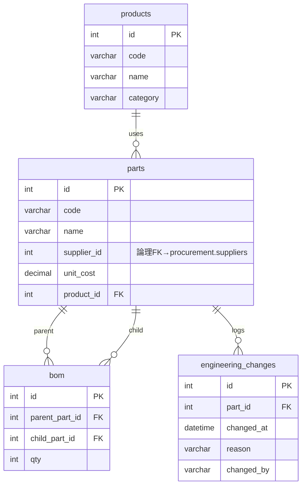
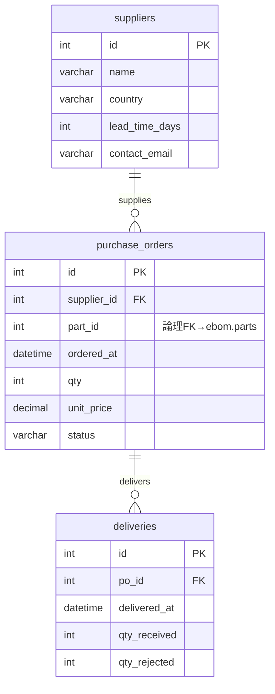
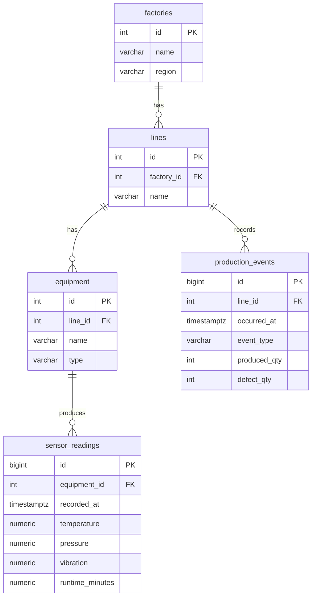
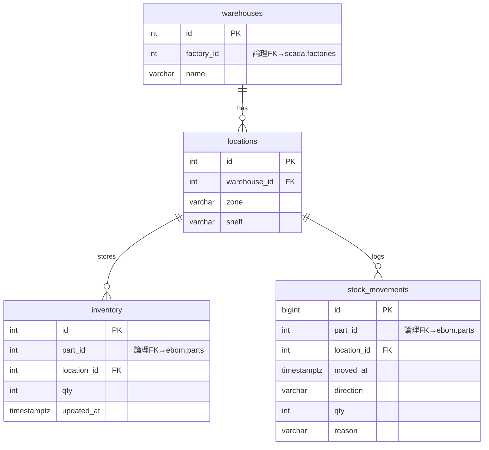
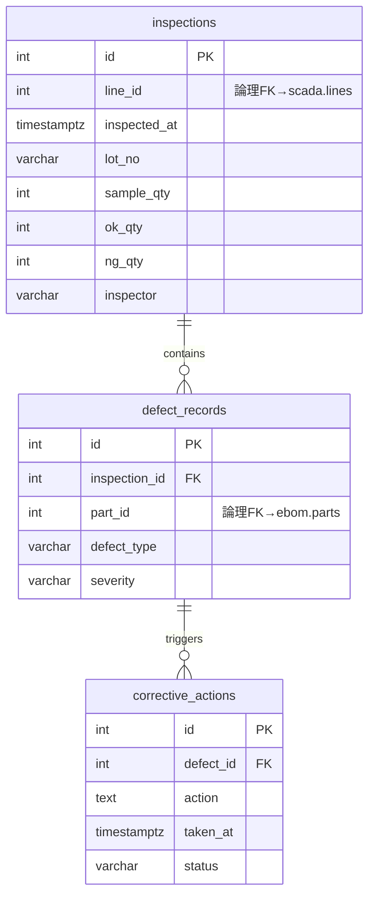

# データベース設計書

工場設備管理デモシステムにおける 5 つの DB の論理・物理設計を一括でまとめたドキュメント。

## 1. アーキテクチャ概要

| # | 業務領域 | エンジン | バージョン | DB 名 | コンテナサービス名 |
|---|---|---|---|---|---|
| 1 | E-BOM(設計部品表) | MySQL | 8.0 | `ebom_db` | `mysql80` |
| 2 | 購買・調達 | MySQL | 5.7 | `procurement_db` | `mysql57` |
| 3 | SCADA(設備稼働履歴・生産実績) | PostgreSQL | 16 | `scada_db` | `postgres16` |
| 4 | WMS / 在庫管理 | PostgreSQL | 13 | `wms_db` | `postgres13` |
| 5 | QMS(品質機能システム) | PostgreSQL | 14 | `qms_db` | `postgres14` |

LLM (Amazon Bedrock / Nova Lite) は MCP サーバー(エンジン別に 2 つ)経由で各 DB に問い合わせる。MCP サーバーは引数で接続先 DB を切り替える。

```
LLM ── mcp-mysql   ──┬─ MySQL 8.0  (ebom_db)
                     └─ MySQL 5.7  (procurement_db)

LLM ── mcp-postgres ─┬─ PostgreSQL 16 (scada_db)
                     ├─ PostgreSQL 13 (wms_db)
                     └─ PostgreSQL 14 (qms_db)
```

## 2. 拠点とライン(全 DB で共通の業務 ID 体系)

物理的な FK は DB 間では張れないため、以下の ID 体系を **アプリ層で取り決め**として全 DB に展開する。

| factory_id | name  | region |
|------------|-------|--------|
| 1          | Tokyo | east   |
| 2          | Osaka | west   |

| line_id | factory_id | name   |
|---------|------------|--------|
| 1       | 1          | Line-1 |
| 2       | 1          | Line-2 |
| 3       | 1          | Line-3 |
| 4       | 2          | Line-1 |
| 5       | 2          | Line-2 |
| 6       | 2          | Line-3 |

> 拠点/ラインのマスタは SCADA(`scada_db`)に正規として持ち、他 DB は `line_id` / `factory_id` だけを参照する。

## 3. ER 図

### 3.1 E-BOM (MySQL 8.0 / `ebom_db`)



### 3.2 購買・調達 (MySQL 5.7 / `procurement_db`)



### 3.3 SCADA (PostgreSQL 16 / `scada_db`)



### 3.4 WMS (PostgreSQL 13 / `wms_db`)



### 3.5 QMS (PostgreSQL 14 / `qms_db`)



## 4. 論理設計

### 4.1 E-BOM (`ebom_db`)

| エンティティ | 属性 | キー / 制約 | 業務ルール |
|---|---|---|---|
| products | id, code, name, category | PK: id / UQ: code | カテゴリは "assembly" / "module" |
| parts | id, code, name, supplier_id, unit_cost, product_id | PK: id / UQ: code / FK: product_id→products | unit_cost > 0 |
| bom | id, parent_part_id, child_part_id, qty | PK: id / FK: 両 part_id→parts / UQ(parent, child) | parent != child, qty ≥ 1 |
| engineering_changes | id, part_id, changed_at, reason, changed_by | PK: id / FK: part_id→parts | reason は必須 |

### 4.2 購買・調達 (`procurement_db`)

| エンティティ | 属性 | キー / 制約 | 業務ルール |
|---|---|---|---|
| suppliers | id, name, country, lead_time_days, contact_email | PK: id / UQ: name | lead_time_days > 0 |
| purchase_orders | id, supplier_id, part_id, ordered_at, qty, unit_price, status | PK: id / FK: supplier_id→suppliers | status ∈ {ordered, partial, delivered, cancelled} |
| deliveries | id, po_id, delivered_at, qty_received, qty_rejected | PK: id / FK: po_id→purchase_orders | qty_received ≥ 0, qty_rejected ≤ qty_received |

### 4.3 SCADA (`scada_db`)

| エンティティ | 属性 | キー / 制約 | 業務ルール |
|---|---|---|---|
| factories | id, name, region | PK: id / UQ: name | Tokyo / Osaka 2 拠点固定 |
| lines | id, factory_id, name | PK: id / FK: factory_id→factories / UQ(factory_id, name) | 各拠点 3 本 |
| equipment | id, line_id, name, type | PK: id / FK: line_id→lines | type ∈ {press, weld, assembly, inspect} |
| sensor_readings | id, equipment_id, recorded_at, temperature, pressure, vibration, runtime_minutes | PK: id / FK: equipment_id→equipment / IX(equipment_id, recorded_at) | recorded_at は 1 時間粒度 |
| production_events | id, line_id, occurred_at, event_type, produced_qty, defect_qty | PK: id / FK: line_id→lines / IX(line_id, occurred_at) | defect_qty ≤ produced_qty |

### 4.4 WMS (`wms_db`)

| エンティティ | 属性 | キー / 制約 | 業務ルール |
|---|---|---|---|
| warehouses | id, factory_id, name | PK: id / UQ(factory_id, name) | 拠点ごとに 1 倉庫 |
| locations | id, warehouse_id, zone, shelf | PK: id / FK: warehouse_id→warehouses / UQ(warehouse_id, zone, shelf) | zone ∈ {A, B, C} |
| inventory | id, part_id, location_id, qty, updated_at | PK: id / FK: location_id→locations / UQ(part_id, location_id) | qty ≥ 0 |
| stock_movements | id, part_id, location_id, moved_at, direction, qty, reason | PK: id / FK: location_id→locations | direction ∈ {in, out} / qty > 0 |

### 4.5 QMS (`qms_db`)

| エンティティ | 属性 | キー / 制約 | 業務ルール |
|---|---|---|---|
| inspections | id, line_id, inspected_at, lot_no, sample_qty, ok_qty, ng_qty, inspector | PK: id / IX(line_id, inspected_at) | ok_qty + ng_qty ≤ sample_qty |
| defect_records | id, inspection_id, part_id, defect_type, severity | PK: id / FK: inspection_id→inspections | severity ∈ {low, medium, high} |
| corrective_actions | id, defect_id, action, taken_at, status | PK: id / FK: defect_id→defect_records | status ∈ {open, in_progress, closed} |

## 5. 物理設計(DDL)

### 5.1 E-BOM (MySQL 8.0)

```sql
SET NAMES utf8mb4;
CREATE TABLE products (
  id INT NOT NULL AUTO_INCREMENT,
  code VARCHAR(32) NOT NULL,
  name VARCHAR(128) NOT NULL,
  category VARCHAR(32) NOT NULL,
  PRIMARY KEY (id),
  UNIQUE KEY uq_products_code (code)
) ENGINE=InnoDB DEFAULT CHARSET=utf8mb4;

CREATE TABLE parts (
  id INT NOT NULL AUTO_INCREMENT,
  code VARCHAR(32) NOT NULL,
  name VARCHAR(128) NOT NULL,
  supplier_id INT NOT NULL,
  unit_cost DECIMAL(10,2) NOT NULL,
  product_id INT NULL,
  PRIMARY KEY (id),
  UNIQUE KEY uq_parts_code (code),
  KEY ix_parts_supplier (supplier_id),
  CONSTRAINT fk_parts_product FOREIGN KEY (product_id) REFERENCES products(id)
) ENGINE=InnoDB DEFAULT CHARSET=utf8mb4;

CREATE TABLE bom (
  id INT NOT NULL AUTO_INCREMENT,
  parent_part_id INT NOT NULL,
  child_part_id INT NOT NULL,
  qty INT NOT NULL,
  PRIMARY KEY (id),
  UNIQUE KEY uq_bom_parent_child (parent_part_id, child_part_id),
  CONSTRAINT fk_bom_parent FOREIGN KEY (parent_part_id) REFERENCES parts(id),
  CONSTRAINT fk_bom_child FOREIGN KEY (child_part_id) REFERENCES parts(id),
  CONSTRAINT chk_bom_diff CHECK (parent_part_id <> child_part_id),
  CONSTRAINT chk_bom_qty CHECK (qty >= 1)
) ENGINE=InnoDB DEFAULT CHARSET=utf8mb4;

CREATE TABLE engineering_changes (
  id INT NOT NULL AUTO_INCREMENT,
  part_id INT NOT NULL,
  changed_at DATETIME NOT NULL,
  reason VARCHAR(255) NOT NULL,
  changed_by VARCHAR(64) NOT NULL,
  PRIMARY KEY (id),
  KEY ix_ec_part (part_id),
  CONSTRAINT fk_ec_part FOREIGN KEY (part_id) REFERENCES parts(id)
) ENGINE=InnoDB DEFAULT CHARSET=utf8mb4;
```

### 5.2 購買・調達 (MySQL 5.7)

```sql
SET NAMES utf8mb4;
CREATE TABLE suppliers (
  id INT NOT NULL AUTO_INCREMENT,
  name VARCHAR(128) NOT NULL,
  country VARCHAR(64) NOT NULL,
  lead_time_days INT NOT NULL,
  contact_email VARCHAR(128) NOT NULL,
  PRIMARY KEY (id),
  UNIQUE KEY uq_suppliers_name (name)
) ENGINE=InnoDB DEFAULT CHARSET=utf8mb4;

CREATE TABLE purchase_orders (
  id INT NOT NULL AUTO_INCREMENT,
  supplier_id INT NOT NULL,
  part_id INT NOT NULL,
  ordered_at DATETIME NOT NULL,
  qty INT NOT NULL,
  unit_price DECIMAL(10,2) NOT NULL,
  status VARCHAR(16) NOT NULL,
  PRIMARY KEY (id),
  KEY ix_po_supplier (supplier_id),
  KEY ix_po_ordered (ordered_at),
  CONSTRAINT fk_po_supplier FOREIGN KEY (supplier_id) REFERENCES suppliers(id)
) ENGINE=InnoDB DEFAULT CHARSET=utf8mb4;

CREATE TABLE deliveries (
  id INT NOT NULL AUTO_INCREMENT,
  po_id INT NOT NULL,
  delivered_at DATETIME NOT NULL,
  qty_received INT NOT NULL,
  qty_rejected INT NOT NULL,
  PRIMARY KEY (id),
  KEY ix_deliveries_po (po_id),
  CONSTRAINT fk_deliveries_po FOREIGN KEY (po_id) REFERENCES purchase_orders(id)
) ENGINE=InnoDB DEFAULT CHARSET=utf8mb4;
```

> MySQL 5.7 は `CHECK` 制約をパースするが強制しない。業務ルールはアプリ層で保証する。

### 5.3 SCADA (PostgreSQL 16)

```sql
CREATE TABLE factories (
  id INT PRIMARY KEY,
  name VARCHAR(64) NOT NULL UNIQUE,
  region VARCHAR(32) NOT NULL
);

CREATE TABLE lines (
  id INT PRIMARY KEY,
  factory_id INT NOT NULL REFERENCES factories(id),
  name VARCHAR(64) NOT NULL,
  UNIQUE (factory_id, name)
);

CREATE TABLE equipment (
  id INT PRIMARY KEY,
  line_id INT NOT NULL REFERENCES lines(id),
  name VARCHAR(64) NOT NULL,
  type VARCHAR(32) NOT NULL CHECK (type IN ('press','weld','assembly','inspect'))
);

CREATE TABLE sensor_readings (
  id BIGSERIAL PRIMARY KEY,
  equipment_id INT NOT NULL REFERENCES equipment(id),
  recorded_at TIMESTAMPTZ NOT NULL,
  temperature NUMERIC(6,2) NOT NULL,
  pressure NUMERIC(6,2) NOT NULL,
  vibration NUMERIC(6,3) NOT NULL,
  runtime_minutes NUMERIC(5,2) NOT NULL
);
CREATE INDEX ix_sensor_eq_time ON sensor_readings (equipment_id, recorded_at);

CREATE TABLE production_events (
  id BIGSERIAL PRIMARY KEY,
  line_id INT NOT NULL REFERENCES lines(id),
  occurred_at TIMESTAMPTZ NOT NULL,
  event_type VARCHAR(16) NOT NULL CHECK (event_type IN ('running','stopped','maintenance')),
  produced_qty INT NOT NULL DEFAULT 0,
  defect_qty INT NOT NULL DEFAULT 0,
  CHECK (defect_qty <= produced_qty)
);
CREATE INDEX ix_prodev_line_time ON production_events (line_id, occurred_at);
```

### 5.4 WMS (PostgreSQL 13)

```sql
CREATE TABLE warehouses (
  id INT PRIMARY KEY,
  factory_id INT NOT NULL,
  name VARCHAR(64) NOT NULL,
  UNIQUE (factory_id, name)
);

CREATE TABLE locations (
  id INT PRIMARY KEY,
  warehouse_id INT NOT NULL REFERENCES warehouses(id),
  zone VARCHAR(8) NOT NULL CHECK (zone IN ('A','B','C')),
  shelf VARCHAR(8) NOT NULL,
  UNIQUE (warehouse_id, zone, shelf)
);

CREATE TABLE inventory (
  id SERIAL PRIMARY KEY,
  part_id INT NOT NULL,
  location_id INT NOT NULL REFERENCES locations(id),
  qty INT NOT NULL CHECK (qty >= 0),
  updated_at TIMESTAMPTZ NOT NULL DEFAULT NOW(),
  UNIQUE (part_id, location_id)
);

CREATE TABLE stock_movements (
  id BIGSERIAL PRIMARY KEY,
  part_id INT NOT NULL,
  location_id INT NOT NULL REFERENCES locations(id),
  moved_at TIMESTAMPTZ NOT NULL,
  direction VARCHAR(8) NOT NULL CHECK (direction IN ('in','out')),
  qty INT NOT NULL CHECK (qty > 0),
  reason VARCHAR(64) NOT NULL
);
CREATE INDEX ix_moves_part_time ON stock_movements (part_id, moved_at);
```

### 5.5 QMS (PostgreSQL 14)

```sql
CREATE TABLE inspections (
  id SERIAL PRIMARY KEY,
  line_id INT NOT NULL,
  inspected_at TIMESTAMPTZ NOT NULL,
  lot_no VARCHAR(32) NOT NULL,
  sample_qty INT NOT NULL,
  ok_qty INT NOT NULL,
  ng_qty INT NOT NULL,
  inspector VARCHAR(64) NOT NULL,
  CHECK (ok_qty + ng_qty <= sample_qty)
);
CREATE INDEX ix_inspections_line_time ON inspections (line_id, inspected_at);

CREATE TABLE defect_records (
  id SERIAL PRIMARY KEY,
  inspection_id INT NOT NULL REFERENCES inspections(id),
  part_id INT NOT NULL,
  defect_type VARCHAR(64) NOT NULL,
  severity VARCHAR(8) NOT NULL CHECK (severity IN ('low','medium','high'))
);

CREATE TABLE corrective_actions (
  id SERIAL PRIMARY KEY,
  defect_id INT NOT NULL REFERENCES defect_records(id),
  action TEXT NOT NULL,
  taken_at TIMESTAMPTZ NOT NULL,
  status VARCHAR(16) NOT NULL CHECK (status IN ('open','in_progress','closed'))
);
```

## 6. DB 間の論理的な参照関係(クロス DB 結合)

物理 FK は張れないが、LLM が複数 DB を横断するクエリを組み立てる際の根拠となる。

| 元(参照側) | 列 | 先(被参照側) | 列 | 用途 |
|---|---|---|---|---|
| `procurement.purchase_orders` | `part_id` | `ebom.parts` | `id` | 部品調達状況の追跡 |
| `ebom.parts` | `supplier_id` | `procurement.suppliers` | `id` | 部品のサプライヤー特定 |
| `wms.warehouses` | `factory_id` | `scada.factories` | `id` | 拠点単位の在庫集計 |
| `wms.inventory` | `part_id` | `ebom.parts` | `id` | 在庫部品の名称解決 |
| `wms.stock_movements` | `part_id` | `ebom.parts` | `id` | 入出庫履歴の部品名解決 |
| `qms.inspections` | `line_id` | `scada.lines` | `id` | ラインごとの品質指標 |
| `qms.defect_records` | `part_id` | `ebom.parts` | `id` | 不良部品の特定 |
| `scada.lines` | `factory_id` | `scada.factories` | `id` | 拠点 → ラインの絞り込み |

## 7. データ規模(seed)

| テーブル | 行数の目安 |
|---|---|
| `ebom.products` | 3 |
| `ebom.parts` | 50 |
| `ebom.bom` | ~80 |
| `ebom.engineering_changes` | ~30 |
| `procurement.suppliers` | 10 |
| `procurement.purchase_orders` | ~200(30 日分) |
| `procurement.deliveries` | ~200 |
| `scada.factories` | 2 |
| `scada.lines` | 6 |
| `scada.equipment` | ~24(6 ライン × 4 台) |
| `scada.sensor_readings` | ~17,280(24 設備 × 24 時間 × 30 日) |
| `scada.production_events` | ~4,320(6 ライン × 24 時間 × 30 日) |
| `wms.warehouses` | 2 |
| `wms.locations` | ~18(2 倉庫 × 3 ゾーン × 3 棚) |
| `wms.inventory` | ~100 |
| `wms.stock_movements` | ~600 |
| `qms.inspections` | ~180(6 ライン × 30 日) |
| `qms.defect_records` | ~300 |
| `qms.corrective_actions` | ~150 |

## 8. 注意事項

- 拠点・ライン ID は SCADA を正としつつ、他 DB はアプリ層の取り決めで同じ ID を使う。本デモは「複数 DB を横断する LLM の挙動」を見せるためであり、本番運用では各 DB のロール/VIEW による GRANT を併用することを推奨する。
- 行レベルのアクセス制御は MCP の手前(`app/system_prompt.py`)で許可スコープをシステムプロンプトに埋め込むことで実現している。LLM がプロンプトに従う前提のソフトな統制である点に留意。
- MySQL 5.7 はサポート終了済みのバージョンだが、「バージョン違いを再現するデモ用途」として採用している。
